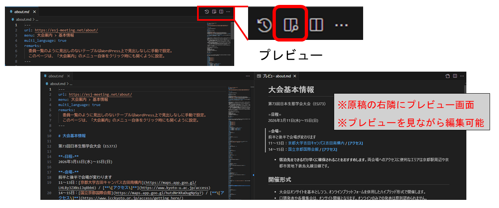

# 運営部会　作業マニュアル

## はじめに

- 運営部会の業務は、大会ウェブサイトを通した大会の広報担当です。
    - 具体的には、ウェブサイトの構成の決定、原稿の執筆依頼と集約、新たなルール等の整理、部会間の調整、および全体のスケジュール管理が業務となります。
- ここでは、部会員としての一連の作業手順について、以下の内容についてまとめています。
    - 全体の流れ
    - 編集環境の準備
    - 自身の原稿の作成
    - 各部会から提出された原稿についてのチェック項目
    - 編集上の留意点

## 全体の流れ

運営部会では、生態学会大会のホームページの更新を数回の「メジャーアップデート」に分割してスケジュール管理を行っています。

- フェーズ1(7月頭): 大会の概要、および申込の早い一部集会（ERシンポ、公募セッション）の告知
- フェーズ2(9月末): 一般講演・各種集会の申込みに必要な情報
- フェーズ3(12月末): 発表準備・参加に必要な情報

各ページの原稿の執筆のうち、運営部会担当なのは約半分ほどです。それ以外のページは、他部会・大会実行委員等でも分担して行います。このため、各フェーズでは、以下のようなステップを踏みます。

1. 運営部会での原稿事前チェック
    - 各部会は担当ページしか知らないため、放っておくと個々に同じような記述があちこちに継ぎ足されてページが肥大化してしまう
    - そこで、運営部会側で昨年の原稿をベースにある程度簡略化や情報の集約等の構成の見直しをしてしまう
2. 各部会への原稿執筆依頼
    - 1で整理した内容をもとに、各部会に原稿の執筆を依頼
    - 昨年からの大会ルール等の変更や気になる点等、執筆時の注意点があれば、併せて伝えておく
3. 運営部会内での執筆作業
    - 運営部会内で分担して、担当ページを執筆
    - 大会関連の情報はSlackのcanvas機能を使って整理されているので、事前に変更点等を確認の上で執筆する
    - 情報の不足や齟齬、未検討の点等が出てきた場合は、運営部会内で相談する
        - 内容によっては企画委員会やウェブページチャンネル等で確認・問い合わせを行う必要がある場合もある
4. 運営部会レビュー
    - 各部会に依頼した原稿および運営部会内で執筆した原稿を集約し、部会員で分担しながら記述内容をチェックする
    - チェックのポイントは、情報に齟齬がないか、誤字脱字や内容に不明瞭な点がないか、といった**参加者目線での内容チェック**と、markdownの記法やサイト全体での表記の統一等の**フォーマットレベルのチェック**
5. 企画委員会での全体レビュー
    - 原稿を非公開の編集用Webサイト（edit版）にアップロードし、そのWebサイトを企画委員会のメンバー全員で確認
    - コメントをつけやすいよう、ページをPDFに変換してGoogle Driveで共有する形をとっている（PDFの機能でコメントがつけられる）
6. 全体レビューコメント反映作業
    - 全体レビューで集まったコメントを原稿に反映
    - 運営部会以外が担当のページについては、担当部会にページを差し戻してしまう
        - ただし、軽微な内容であれば運営部会内でやってしまった方が楽
7. 最終確認
    - 全体レビューのコメント反映後の最終稿を非公開の編集用Webサイト（edit版）にアップロードし、改めて企画委員会のメンバー全員で確認
8. Webサイト公開
    - サイト管理班がWordpress環境を編集用Webサイト（edit版）から本番用Webサイトへとコピーし、本番環境に反映

## 編集環境の準備

原稿の編集に使用するのは二種類です。

- Webページの原稿は Markdown形式（mdとも略されます）で記載しており、Markdown形式を編集できる環境が必要。
- 原稿はgitと呼ばれるバージョン管理ツールで管理されており、gitを使用できる環境があると便利。

gitは必ず必要なわけではありませんが、gitを使うことで、他の人が編集した原稿を取り込んだり、過去の編集履歴を参照したりすることが容易になります。以下、gitを使用する場合と使用しない場合、それぞれのケースについての環境の準備を説明します。

### 1.gitを使用する場合

gitは、オンラインサーバーと同期しながらファイルを共同編集するためのツールです。オンラインストレージと似ていますが、以下の点に特徴があります

- サーバーとローカルの同期は手動で行う
- 変更時に変更内容についてコメントを残す
- 複数のバージョンを同時並行で開発・管理するために、履歴を「枝分かれ」させられる

gitについてよく知らない場合は、まず以下のページの解説を一通り参照しておくことをお勧めします。  
[【git入門】](https://hmito.github.io/learning/git)

1. VSCodeおよびgitを使える環境を準備する。お勧めは[このページ](https://hmito.github.io/learning/git/setup.html)に沿った準備。
2. GitHubに[アカウントを作成](https://hmito.github.io/learning/git/setup.html#%E3%83%9B%E3%82%B9%E3%83%86%E3%82%A3%E3%83%B3%E3%82%B0%E3%82%B5%E3%83%BC%E3%83%93%E3%82%B9%E3%81%AE%E3%82%A2%E3%82%AB%E3%82%A6%E3%83%B3%E3%83%88%E3%81%AE%E7%94%A8%E6%84%8F)。すでに持っていればスキップしてよい。
3. esj用ウェブサイトのgitに共同編集者に招待してもらう（運営部会内で聞くとよい）。招待してもらうためには、GitHubアカウントの「メールアドレス」もしくは「ユーザー名」が必要。
4. 共同編集者に招待されたら、[「リモートにすでにリポジトリがある」ケース](https://hmito.github.io/learning/git/remote.html#%E3%82%B1%E3%83%BC%E3%82%B92%E3%83%AA%E3%83%A2%E3%83%BC%E3%83%88%E3%81%AB%E3%81%99%E3%81%A7%E3%81%AB%E3%83%AA%E3%83%9D%E3%82%B8%E3%83%88%E3%83%AA%E3%81%8C%E3%81%82%E3%82%8B)を参考に、リポジトリをクローンする。
    - なお、**ESJ74のリモートリポジトリのURL**は以下の通り。このURLをコピーしたら、リンク先のステップ1を飛ばしてステップ2から進める  
    `https://github.com/hmito/esj74web.git`

これで環境の準備は終了です。

普段の編集作業の流れは以下の通りです。

1. クローンしたリポジトリのフォルダをVSCodeで開く（メニューバーの「ファイル」→「フォルダを開く」）。
2. ブランチを作業用の「phaseX」(Xは1,2,3のいずれか)に切り替える。
    - ブランチの切り替えは、VSCodeの左下にある「main」などと書かれた部分をクリックして、表示されるメニューから切り替えたいブランチ（origin/phaseX）を選択する。
    - VSCodeの左下にある「main」などと書かれた部分が「phaseX」に変わっていれば、切り替え成功。
3. 編集したい原稿ファイルをVSCodeで開く。
    - VSCodeの基本的な使い方は、[このページ](https://hmito.github.io/learning/vscode.html)を参照。
4. サーバーとローカルを同期する。VSCodeの左メニューの「ソース管理」タブ（丸3つが線でつながれたアイコン）を開き、上部にある「変更」の欄にマウスを置くと表示される「…」をクリックして「プル」を選択する
    - 同期の詳細は、[このページ](https://hmito.github.io/learning/git/remote.html#%E5%90%8C%E6%9C%9F%E3%83%97%E3%83%83%E3%82%B7%E3%83%A5%E3%81%A8%E3%83%97%E3%83%AB)参照。
    - エラーが出たら、おそらく編集内容が他者と競合コンフリクトしている。[このページ](https://hmito.github.io/learning/git/merge.html#%E7%B7%A8%E9%9B%86%E3%81%AE%E7%AB%B6%E5%90%88%E3%82%B3%E3%83%B3%E3%83%95%E3%83%AA%E3%82%AF%E3%83%88)を参考に、競合を解決する。
5. VSCodeの左メニューの「エクスプローラー」タブ（最上部のファイルアイコン）を開き、必要なファイルを開いて編集する。
6. 編集が終わったら、VSCodeの左メニューの「ソース管理」タブを開き、編集したファイルを変更欄の上で選択して「+」ボタンを押して「ステージされている変更」に移す。変更内容を簡単に日本語でメッセージ欄に書き込み、「コミット」を押す
    - このあたりの作業は、[このページ](https://hmito.github.io/learning/git/commit.html#%E3%83%95%E3%82%A1%E3%82%A4%E3%83%AB%E3%81%AE%E5%A4%89%E6%9B%B4)参照。
7. コミットが終わったら、VSCodeの左メニューの「ソース管理」アイコンをクリックし、上部にある「…」をクリックして「プッシュ」を選択する。
    - エラーが出たら、おそらく編集内容が他者と競合コンフリクトしている。[このページ](https://hmito.github.io/learning/git/merge.html#%E7%B7%A8%E9%9B%86%E3%81%AE%E7%AB%B6%E5%90%88%E3%82%B3%E3%83%B3%E3%83%95%E3%83%AA%E3%82%AF%E3%83%88)を参考に、競合を解決する。

### 2.gitを使用しない場合

1. Markdown形式の原稿を編集できるエディタを用意する。
    - お勧めは[Visual Studio Code (VSCode)](https://code.visualstudio.com/)。インストールと使い方は、[このページ](https://hmito.github.io/learning/vscode.html)参照。
    - RStudioでも表示・編集可能。

普段の編集の流れは以下の通りです。

1. esj用webのgit管理者から、原稿のダウンロード用のURLをもらう。
2. 原稿をダウンロードし、Markdown形式が編集できるエディタ上で編集作業を行う。
3. 編集が終わったら、原稿をSlackの運営部会チャンネルにアップロードし、取り込みを依頼する。

## 運営部会レビューじのチェック事項

運営部会レビュー時のチェック内容には、**参加者目線での内容チェック**と**フォーマットレベルのチェック**があります。

それぞれ、チェックポイントを整理します。

### 参加者目線での内容チェック

こちらはそのまんまで、自分が参加者の立場でページを読んでのチェックです。主な目的は、不要な問い合わせの削減です。

1. **情報に齟齬がないか**：類似の情報が記載されているページの間で記述矛盾が無いか、表記に揺れが無いか。
2. **誤字脱字や読みにくさはないか**：適宜句読点を入れる、文を整理するなど内容を変えない校閲は適宜行って構いません。
3. **不足する情報はないか、曖昧なケースはないか**：記述が曖昧だったり不十分だったりするゆえに、問い合わせが殺到するケースがしばしばあるため、様々なケースを想定しつつ、少し意地悪な参加者になったつもりで問い合わせに至りそうな記載がないかを確認します。
4. **情報は一か所に集約されているか**：一つの情報は一か所に集約する方針で編集しています。このため、他のページと類似の記載があると感じた場合は、関連ページへのリンクで置き換えられないか検討してください。必要であれば、ページをまたいでセクションを統廃合しても構いません。

### フォーマットレベルでのチェック

markdownの記法やサイト全体での表記の統一に関する、形式部分の確認です。

#### 1. yamlヘッダのチェック

yamlヘッダとは各ページの上部にある2つの"---"で挟まれた部分で、各ページのメタデータを記載しています。以下の4つの項目がありますので、これらに誤りがないかをチェックしてください。

```markdown
(例) 大会案内ページ(about.md)

---
url: https://esj-meeting.net/about/
menu: 大会案内 > 基本情報
multi_language: true
remarks:
  委員一覧のように見出しのないテーブルはWordPress上で見出しなしに手動で設定。
  このページは、「大会案内」のメニュー自体をクリック時にも開くように設定。
---
```

- **url**: 各ページのURLを示します。"esj-meeting.net/"までは共通で、その後は原則として原稿のファイル名をURLとして指定してください (上記例の場合は"about")。
- **menu**: 上部ページ (サイト上部のバー)と下部ページの構造を示します。計画されたメニュー名かを確認してください。
- **multi_language**: 英語版ページの有無を指定します。有ならばtrue、無ならばfalseで指定してください。
- **remarks**: 色指定、図表、添付ファイルがページ内にないかを確認し、あればその旨をメモ書きしておいてください。これらについては、サイト管理班が手動で操作する必要があるため、操作漏れを防ぐために必ず記載が必要です。

#### 2. Markdown記法の誤りのチェック

[Markdown記法の解説](esj_web_markdown.md)とも内容が重複しますが、Markdown (及びWordpress)は一般的なテキストとは異なる仕様がありますので、それに係る誤りをチェックする必要があります。主な項目を以下に記載しますが、これ以外にも何か留意したほうが良い点があれば適宜の追記をお願いします。

#### 2.1. リストの構成

- 一つの項目についてのリストは空白行なしで書いてください。空白行があると別のリストとして扱われます。

```markdown
(正しい例)
- 要素1
- 要素2
- 要素3

(誤った例)
- 要素1

- 要素2

- 要素3
```

- リスト内で字下げをする場合、**半角スペース4つ**を用いてください。半角スペース2つでもプレビュー画面上は字下げされていますが、Wordpress上ではうまく機能しないようです。

```markdown
(正しい例)  ※半角スペース4つ
- 要素1
    - 要素1-1
    - 要素1-2

(誤った例)  ※半角スペース2つ
- 要素1
  - 要素1-1
  - 要素1-2
```

#### 2.2. リンクの設定

- 原稿内のリンクから別の原稿や見出しに想定通りにアクセスできるかを確認してください (Ctrlキーを押しながらクリックするとリンク先に飛べます)。
    - ただし、まだ開設されていないページ (例えば、オープン前の大会参加登録用のサイト)も存在しますので、それはそのままで構いません (URLが確定した段階でリンクをはる)。
- うまく飛べない場合、リンクに使う文字列 ([]内)とリンク先URL (()内)の記法に間違いがないかを確認してください。

```markdown
(正しい例)
[リンク文字列](リンク先URL)

(誤った例)
[リンク文字列] (リンク先URL)        ※[]と()の間にスペース
［リンク文字列］（リンク先URL）      ※[]や()が全角文字
```

- esj用webサイト内の別のページへ飛ぶ場合にはリンク先URLの先頭に/を入れてください。
- ページ内の特定のセクションへのアンカーリンク（#セクション名）の記述では、大文字小文字は区別し空白はハイフン (-)に置き換えてください。

```markdown
(例) 大会のホームに飛ぶ場合
[ホーム](/home.md)

(例) 英語版ホームのMeeting informationに飛ぶ場合
[Meeting information](/home_en.md#Meeting-information)
```

- ただし、WordpressとVScodeの仕様がお互いの変更によって噛み合わなくなると、(実際は問題がないにもかかわらず)VScode上ではうまく機能しないことはありえるので、その点は留意してください。

#### 2.3. 見出しの構造

- 見出しのネスト構造が適正かどうかチェックしてください。

```markdown
(例) 正しい例
# 見出しレベル1
## 見出しレベル2
### 見出しレベル3

(例) 誤った例
# 見出しレベル1
### 見出しレベル3
## 見出しレベル2
```

### 3. 英語版の用語の表記ゆれチェック

各部会に個別に執筆を依頼したり運営部会員も複数人で編集をする都合上、用語の表記ゆれが頻発します。特に、英語版は一つの日本語用語に対して複数の英訳がありえますので、無用な混乱を防ぐために表記を統一する必要があります。主な例を以下に記しますが、これ以外にも何かあれば適宜の追記をお願いします。

- **大会**: (annual) meeting (conferenceも文脈次第では許容?)
- **一般講演**: regular presentation
    - **口頭発表**: oral presentation
    - **ポスター発表**: poster presentation
- **シンポジウム**: symposium/symposia
- **自由集会**: workshop
- **正会員 (一般・学生)**: regular/student members
- **名誉会員**: emeritus members
- **賛助会員**: supporting members
- **セルフ・オンデマンド配信**: Self On-Demand Streaming
- **シンポジウム招待講演制度**：symposium invited speaker program

## 編集上の留意事項

いくつかの原稿は、前大会から大枠を変えずに、詳細の情報 (例えば、大会会場や日程等)のみを今大会仕様に変更するだけの軽微な編集で済むと思われます。しかし、前大会から大きなレギュレーションの変更が入った場合は、大幅な加筆・修正が必要になります。また、大会において新規の企画等が立ち上げられた場合は、そのページを一から作成する必要もあるでしょう。ここでは、そのような編集をするにあたっての留意事項 (というよりは大まかな指針や心構え?)を記載します。尚、Gitには編集の履歴が記録され、変更の差し戻しも容易ですので、(それが採用されるかは別にして)編集自体は大胆に行ってしまっても問題ありません。

### 1. 前大会からの変更点は強調して記載

- 一般の参加者は大会のレギュレーション変更についてはホームページを見て初めて知ることになります。また、すべての参加者がホームページを隅から隅までチェックするわけではないと想定されます。
- そのような人たちも含めて可能な限り多くの人に周知できるように、潜在的に多くの参加者が関わるような重要な変更は**太字**や<span style="color: red">色の変更</span>や<span style="font-size: 175%">サイズの変更</span>などを用いて強調して記載しましょう (ただし、やりすぎると画面がうるさくなるのでほどほどに)。
- また、重要な変更についてはホーム画面に記載してもいいかもしれません。

### 2. 情報は整理して記載

- 以前のバージョンから情報の加筆・削除・変更を漫然と繰り返していると、ページ内での情報の重複・欠落・矛盾が蓄積し、可読性が下がるだけでなく誤解や混乱の原因になります。
- 特に、ある事項に大きな変更が入ると、芋づる式に他の事項も修正が必要になる場合があり、それを放置すると全体として矛盾が生じてしまいます。
- このような大きな変更が必要となる場合には、適宜見出しをつけたり、情報を提示する順番を変えたりなどして、全体として一貫した情報を提示できているか確認してください。

## VSCodeの便利な機能

### プレビュー機能について

各原稿の右上にあるプレビューボタンをクリックすると、編集画面とは別タブでMarkdownのプレビューが表示されます。意図した表示となるかチェックしながら編集できるため、非常に便利です。



### 拡張機能

VSCodeは「拡張機能」と呼ばれるアドインを入れることで、追加機能を利用できます。VSCodeの左メニューの「拡張機能」タブ（４つの正方形が書かれているアイコン）からインストールできます。

git使用上のおすすめは、[このページ](https://hmito.github.io/learning/git/setup.html#vscode%E3%81%B8%E3%81%AE%E6%8B%A1%E5%BC%B5%E6%A9%9F%E8%83%BD%E3%81%AE%E5%B0%8E%E5%85%A5)でも進めている以下の二つです。

- Git Graph：Gitの変更履歴全体をより視覚的に分かりやすく表示する機能を追加
- Git History：個別のファイル毎の変更履歴を整理して表示する機能を追加

markdown演習場便利なのは以下の二つです。

- markdownlint：markdownのよくある記法ミスを波線で表示してくれる機能を追加
- Trailing Spaces：行末の空白を赤字にして見やすくする（ESJのウェブページでは、改行は行末に半角スペース二つを置いて指定するため）

### 差分の表示

いつどのような変更が行われたのかを確認するために、ファイルの差分をしばしば確認する必要が出てきます。VSCodeでは、目的に応じていくつか差分の確認方法があります。

#### 1. コミット前の自分の変更を調べる

VSCodeの左メニューの「ソース管理」タブにある「変更」上のファイルは、閲覧すると差分が表示されます。ステージする前のファイルであれば、この状態でも編集ができます。

#### 2. 過去の変更履歴を調べる

[このページの「履歴を見る」](https://hmito.github.io/learning/git/commit.html#%E5%B1%A5%E6%AD%B4%E3%82%92%E8%A6%8B%E3%82%8B
)でも説明がある通り、上述の拡張機能GitGraphで各履歴を選択すると、どのファイルがどのように変更されたかを簡単に確認できます。

ある履歴をクリックした後、別の履歴をCtrlキーを押しながらクリックすると、二つの履歴の間の全ての差分が確認できます。

#### 3. 特定の二つのファイルの間の差分を調べる

二つの別ファイルの中身を単純に比較したい場合は、[ファイルの比較機能を使います](https://hmito.github.io/learning/vscode.html#%E3%83%95%E3%82%A1%E3%82%A4%E3%83%AB%E3%81%AE%E6%AF%94%E8%BC%83)）。

1. 変更「前」のファイルをエクスプローラで右クリックし、「比較対象の選択」を選ぶ
2. 変更「後」のファイルをエクスプローラで右クリックし、「選択項目と比較」を選ぶ
