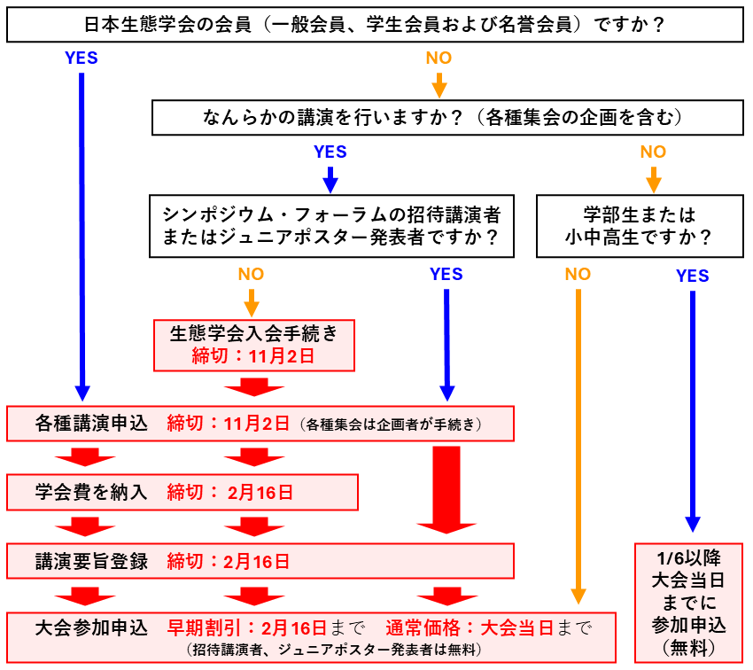

# 各種申込み概要

[一般講演](/regist_oralposter)、[シンポジウム](/regist_session/#シンポジウム)、[自由集会](/regist_session/#自由集会)を募集中です。締切は2025年10月31日です。詳細を確認の上、下記申込みサイトからお手続きください。

**<a href="https://iap-jp.org/esj/conf/login.php" target="_blank">【大会参加・各種講演申込みサイトへ移動】</a>**

重要な締切日は以下の通りです

||**2026年11月2日（月） 23時59分まで**|**2027年2月16日（火） 13時00分まで**|**2027年2月16日（火） 23時59分まで**|**大会当日まで可能**|
|:---:|---|---|---|---|
|[**大会参加に必要な手続き**](#大会参加申込み)||早期割引価格参加申込み 　一般：17000円 　学生：8500円||通常価格参加申込み 　一般：19000円 　学生：9500円|
|[**講演や集会の企画に必要な手続き**](#講演及び各種集会の申込み)|講演及び集会の申込み締切||講演要旨登録締切||
|[**非会員の生態学会への 新規入会手続き**](#生態学会への新規入会手続き)|生態学会新規入会手続き||学会費入金締切||

- シンポジウムの招待講演者、ジュニアポスター発表者、企画・講演を行わない学部生・小中高生は無料で参加できます。
    - フォーラムの招待講演者は当該フォーラムに限り無料で参加可能です。他の企画・集会等に参加される場合は大会参加費をお支払いください。
- 2026年11月21日～2027年1月5日まで、および2027年2月16日13時～2027年2月19日9時の間は、システムメンテナンスのため大会参加申込みができません。
- 2025年から学会費が未納の会員は、納付が確認できるまで[各種申込み手続きができません](#2025年から学会費未納の場合各種手続きができません)。**講演申込み締切の一週間前**には納入いただきますようお願いいたします。
    - 学会費の納入状況は <a href="https://iap-jp.org/esj/mypage/login/login" target="_blank">【マイページ】</a> からご確認ください。

## 大会参加申込み

以下のページから大会参加申込みが可能です。

**<a href="https://iap-jp.org/esj/conf/login.php" target="_blank">【大会参加申込みサイトへ】</a>**

||早期申込み 2/16 13時まで|通常申込み 2/19 9時以降|
|---|---|---|
|**一般**|17000円|19000円|
|**学生**|8500円|9500円|
|**招待講演者、ジュニアポスター発表者 講演のない学部生・小中高生**|無料|無料|

- 大会参加申込みと参加費支払い手続きは、時期により利用するシステムが異なります。
    - 2026年11月20日までは大会申込みサイト、2027年1月6日以降は大会プラットフォーム（らくらくカンファレンス）を利用します。
    - 2026年11月21日～2027年1月5日まで、および2027年2月16日13時～2027年2月19日9時の間は、システムメンテナンスのため、いずれも参加申込み・参加費の支払いは行なえません。
    - 参加申込みと支払いを別の時期に別のシステムで行なっても問題ありません。
- 大会参加費を支払わなければ、ポスターの閲覧やアップロードができません。できる限り大会当日までに大会参加申込みと参加費の支払手続きを完了してください。
- 非会員の方でも、参加費をお支払いいただければ聴講者としてご参加いただけます。2027年1月6日以降に大会プラットフォーム上から大会参加申込みをなってください。
    - なお、大学学部学生の聴講のみの大会参加費は無料です。
- [ジュニアポスター](/juniorposter)での発表者、小中高生の参加・見学、および各団体3名までの小中高生の引率者の大会参加費は無料です。詳細は[こちらのページ](/juniorposter#参加費)をご確認ください。なお、[みんなのジュニア生態学講座](/juniorlec)も無料でご参加いただけます。
- [その他の注意点](#その他注意点)もご確認ください。

## 講演及び各種集会の申込み

以下のページから講演及び各種集会の申込みが可能です。各講演についての説明（下記表のリンク）および[その他の注意点](#その他注意点)もご確認の上、申込みを行ってください。

**<a href="https://iap-jp.org/esj/conf/login.php" target="_blank">【講演及び各種集会の申込みへ】</a>**

<table>
  <colgroup>
  <col style="width: 20%" />
  <col style="width: 40%" />
  <col style="width: 40%" />
  </colgroup>
  <thead><tr class="header">
  <th>講演種別</th>
  <th><strong>申込締切</strong></th>
  <th><strong>要旨締切</strong></th>
  </tr></thead>
  <tbody>
    <tr class="odd">
      <td><a href = "opensession">公募セッション</a></td>
      <td><del>2026年7月31日(金) 23:59</del></td>
      <td rowspan=7>2027年2月頃を予定 (変更の可能性あり)</td>
    </tr>
    <tr class="even">
      <td><a href = "ersympo">ERシンポジウム</a></td>
      <td><del>2026年8月31日(月) 23:59</del></td>
    </tr>
    <tr class="odd">
      <td>フォーラム</td>
      <td><del>2026年9月15日(火) 23:59</del></td>
    </tr>
    <tr class="even">
      <td>シンポジウム 
      <td rowspan=4> 受付開始予定: 2026年10月1日(木)  締切: 2026年11月2日(月) 23:59</td>
    </tr>
    <tr class="odd">
      <td><a href="/regist_session#自由集会">自由集会</a></td>
    </tr>
    <tr class="even">
     <td><a href="/regist_oralposter">一般講演</a> 
    </tr>
    <tr class="odd">
      <td>ジュニアポスター </td>
    </tr>
  </tbody>
</table>

- 各締切日の17:00〜翌日10:00はお問い合わせに対応できません。各種手順の確認はお早めにお願いします。
- すべての締切に関して、締切後の追加や修正等の依頼には対応できません。
- 申込みに際しては、[その他の注意点](#その他注意点)もご確認ください。

## 複数講演の制限

- シンポジウム・自由集会・口頭発表・ポスター発表などの発表形式に関わらず、**講演要旨\(※\)を登録する発表は1人1講演まで**となります。
    - 自由集会と一般講演双方で講演者となることは、本大会では認められません。
    - 制限は自身が講演者となる場合のみです。共同発表者（共著者）となることは差し支えありません。また、各種委員会のイベントであるフォーラムにおける講演は、複数講演の制限の対象となりません。
- ポスター発表を除き、**講演要旨\(※\)を登録する発表は全てオンサイトでの発表が必要**です。ただし、[合理的配慮](/reasonable_accom)に基づく場合を除きます。
- 上記講演とは別に、趣旨説明、コメンテータ、パネラー、ライトニングトークなど講演要旨\(※\)を登録せず行う発表や、集会の企画のみを行うことはできます。
    - ただし、シンポジウムと口頭発表は同一の時間帯に実施される可能性があります。仮に講演時間が重複しても発表枠の調整は行いません。お問い合わせいただいても対応いたしかねますので、十分ご注意ください。
    - 自由集会については集会の形式が多様であることから、シンポジウム・口頭発表と重複しない時間帯に割り当てられる予定です。
- なお、企画可能な集会は、これまで通りフォーラム企画を除いて1人1件までです。複数の集会に企画者として登録することはできません。

※ 講演者ごとに登録する『講演要旨』が本制限の基準となります。各種集会の企画者が申込時に「講演」として登録せず、『集会要旨』へのみ発表に関する情報を記載する場合は、上記制限の対象となりません。

## 会員種別ごとの講演資格

大会では、講演者（主たる発表者）は原則として会員（正会員および名誉会員）に限ります。非会員の方が講演可能なのは以下の3つのケースです。

- シンポジウム招待講演者として講演する場合
- シンポジウム・自由集会において、趣旨説明、コメンテータ、パネラー、ライトニングトークなど講演要旨の登録を伴わない発表を行う場合
- 高校生以下の生徒等がジュニアポスターにおいて講演する場合

なお、講演の共同発表者については、会員である必要はありません。

|**講演種別**|**会員 ※1**|**非会員**|
|:-----------|:------------:|:---------:|
|一般講演（口頭発表・ポスター発表）|◯||
|シンポジウム・自由集会の企画|◯||
|シンポジウムでの講演|◯|◯ ※2|
|自由集会での講演|◯||
|シンポジウム・自由集会での 講演要旨を登録しない発表※3|◯|◯|

※1　日本生態学会の正会員（一般・学生）および名誉会員を指します。賛助会員は含まれません。  
※2　招待講演者に限ります。  
※3　集会企画者が申込時に「講演」として登録していない発表に限ります。

## 生態学会への新規入会手続き

非会員の方は、[一部の例外](#会員種別ごとの講演資格)を除いて各種講演を行うことができません。例外に該当しない非会員の方は、**各種申込みに先立って生態学会への入会手続き**を行う必要があります。入会手続きには時間を要する場合がありますので、余裕を持って手続きをお済ませください。

**<a href="https://www.esj.ne.jp/esj/Nyukai.html#Join" target="_blank">【生態学会新規入会手続きサイトへ】</a>**

1. 上記リンクから新規入会手続きを行ってください。「入会希望年」は「2027年（2027年大会で発表する権利があります）」を選んでいただければ、ESJ74で発表可能です。
2. 入会申込みが確認でき次第、会員業務窓口より仮会員番号を通知します。
3. 仮会員番号を用いて集会および講演の申込みを行なってください。
4. 後日郵送されてくる「請求書」に付属する払込用紙にて学会費をお支払いください。

## その他注意点

### 英語口頭発表賞の廃止について

英語口頭発表賞は、学会員の国際化を促進することを目的として設立され、これまで多くの若手研究者に英語での発表機会と励みを提供してまいりました。本賞は、その趣旨に沿って大きな成果を挙げ、学会員の国際的な活動推進に十分に資する役割を果たしてきました。また、近年では応募数が年々増加し、多くの会員が積極的に英語での発表に取り組むようになったことで、当初の目的は十分に達成されたと判断いたしました。これらの成果を踏まえ、本賞はその役割を終えることとなりますが、英語口頭発表のセッションは今後も継続いたします。ESJ73大会では、英語口頭発表者に対して粗品を進呈する予定にしていますので、引き続き、会員の皆様の積極的なご参加を心よりお待ちしております。

判断の経緯については、生態学会長のメッセージ<a href="https://esj.ne.jp/esj/message/09kitajima/no0902.html" target="_blank">「大会の国際化をどうすすめるか」</a>もご覧ください。

### 2025年から学会費未納の場合各種手続きができません

2025年から年会費が未納の方は、2025年分の会費のご納入を窓口で確認できるまでは、2027年大会での講演申込みも出来ない状況となります。入金を窓口で確認しステータスの更新を行うまでは発表申込みができませんので、**講演申込み締切の一週間前**には会費の納入を済ませていただけますようお願いいたします。

なお、会費の納入状況の確認は<a href="https://iap-jp.org/esj/mypage/login/login" target="_blank">マイページ</a>からご確認ください。

### 自由集会のみへの参加枠の廃止について

これまでESJの大会では、参加申込みに「自由集会のみ聴講」のカテゴリーを設けておりました。しかし、自由集会の開催には少なくない運営経費が必要であることや、過去数年間においてこのカテゴリーでの参加申込み者が少数であったことなどの事情を考慮し、理事会での議論を経て、ESJ72大会から「自由集会のみ聴講」のカテゴリーを廃止しました。自由集会のみの聴講を希望される方も、恐れ入りますが通常枠での大会参加手続きをお願いいたします。

### 参加証・領収書の発行

参加証・領収書は大会申込みサイトではなく大会プラットフォーム「らくらくカンファレンス」から発行されます。印刷物での送付はありませんのでご注意ください。「らくらくカンファレンス」が公開される2027年1月6日以降にダウンロード可能となります。

- 領収書に記載されている金額は会員（一般・学生とも）の場合は不課税（課税対象外）、非会員の場合は税込み金額（課税対象：税率0%）です。
- また、参加費用は研究発表・集会に参加するための費用になります。ランチ、懇親会代等の**飲食物の提供に伴う費用は一切含まれておりません**。
- 本学会は適格請求書発行事業者に**登録しておりません**ので、インボイスの発行は承りかねます。

### 公費支払いについて

参加費の公費支払い（請求書払いなど）をご希望の場合、手続き時期に応じて以下のいずれかを行ってください。

- **【11月20日まで】** まず、参加申込を行ってください。決済方法として「郵便振替」をご選択の上、申込みを完了した上で、問い合わせページにてお問合せください。なお、支払いは前払いにてお願いしております。
- **【1月6日以降】** らくらくカンファレンスの決済画面で「銀行振込」を選択し「振込先口座情報を表示する」をクリックしてください。 ご登録のメールアドレスに銀行口座情報のご案内のメールが届きますので、【振込先口座情報】を添えて、公費支払い希望の旨を問合せフォームよりご連絡ください。なお、請求書の宛名に指定がある場合はあわせてお知らせください。

2026年11月21日～2027年1月5日まで、および2027年2月16日13時～2027年2月19日9時の間はシステムメンテナンスのため、いずれも参加申込み・参加費の支払いは行なえません。

### 正誤表の廃止

本大会では講演申込みや企画提案後の正誤表による修正を受け付けません。申込み講演要旨提出時に、内容に誤りがないか十分にご確認ください。特に学会参加経験の少ない学生は、タイトルや発表者情報などについて、指導教員などと十分に相談の上、お申込みください。

### キャンセルポリシー

- 大会講演をキャンセルされる場合、大会参加費の返金を希望される場合は、必ずお手続きください。
- **大会参加費の返金期限は 2027年2月20日<!--TODO 日程検討中、要確認--> です**。この日までに参加キャンセルの申し出があった場合は、振込手数料等の経費を除き返金いたします。期限を過ぎた場合は、原則として返金いたしませんので、ご注意ください。
- 発表登録締切後（2026年11月2日 23時59分）は、講演をキャンセルしてもプログラム及びホームページ上の登録情報に反映されない場合があります。予めご了承ください。

#### キャンセル方法

- [問い合わせページ](/contact)から、以下のそれぞれの**ケースに応じた件名**を付けたうえでご連絡ください。
    - 講演を登録していない（聴講のみ）：「**大会参加キャンセル（聴講）**」
    - 講演と大会参加の両方をキャンセル：「**大会参加キャンセル（発表番号 or 発表受付番号）**」※
    - 講演のみキャンセルし大会には参加：「**講演のみキャンセル（発表番号 or 発表受付番号）**」※
- なお、発表登録締切前であれば、講演のキャンセルは<a href="https://iap-jp.org/esj/conf/login.php" target="_blank">**各種講演申込みサイト**</a>からご自身で操作できます。

※ 発表番号・発表受付番号は、プログラムまたは発表登録時に自動送信されるメールをご確認ください。

### 災害時の研究成果の取扱

講演要旨を登録の上、期日までに大会参加費を支払った講演者は、以下の事由により講演できなかった場合でも、本学会大会講演要旨を公開しているウェブページ上の講演情報および要旨を本学会が業績として認めます。

- 火災、地震、気象災害、人災、感染症などによる大会の中止
- 大会プラットフォームの障害や大規模なネットワークの障害

ただし、大会参加費を期日までに支払わなかった場合、本学会大会講演要旨を公開しているウェブページから講演情報および要旨を削除し、プログラムに記載があったとしても、当該研究は業績として認定しません。
