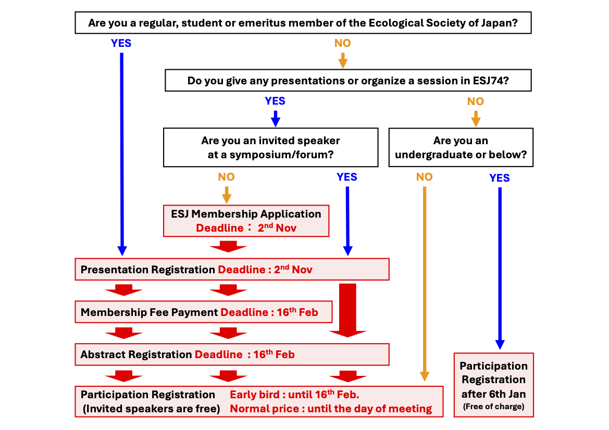

# Registration Overview

Applications for [Regular Presentations](/regist_oralposter_en), [Symposia](/regist_session_en#Symposium), and [Workshops](/regist_session_en#Workshop) are accepted until 2nd Nov. 2025 23:59 (JST). Please check the details in below and register from the application site.

**<a href="https://iap-jp.org/esj/conf/login_en.php" target="_blank">[Go to the Applications site]</a>**

Important deadlines are as follows.

||**2nd Nov. 2026 23:59 (JST)**|**16th Feb. 2027  13:00 (JST)**|**16th Feb. 2027  23:59 (JST)**|**Until the day of the conference**|
|:---:|---|---|---|---|
|[**Procedures for participation in the conference**](#Registration-for-Participation)||Early bird registration 　Regular：17000 JPY 　Student：8500 JPY||Normal price registration 　Regular：19000 JPY 　Student：9500 JPY|
|[**Procedures for Presentations and Sessions**](#Application-for-Presentations-and-Sessions)|Deadline for Proposals||Deadline for Abstract Submission||
|[**Non-members joining the ESJ for presentations**](#Procedure-for-new-membership-to-the-Ecological-Society-of-Japan)|Deadline for new members to join the ESJ||Deadline for payment of membership fee||

- Invited speakers at symposia, and undergraduate or below who are not organizers and speakers can participate without registration fee.
    - Invited speakers at forum may participate in the forum without registration fee, but those who wish to participate in other sessions or meetings are required to pay the conference registration fee.
- Due to system transition, registrations will not be available from 21st Nov. 2026 to 5th Jan. 2027, and from 16th Feb. 2027 13:00 to 19th Feb. 2027 9:00.
- Members who have not paid the membership fee from 2024 will [not be able to complete the registration and application procedures](#If-you-have-not-paid-the-membership-fee-from-2024-you-will-not-be-able-to-complete-any-procedures) until payment is confirmed. Please pay the membership fee, at least, **one week before the deadline**.
    - You can check the payment status of the membership fee from <a href="https://iap-jp.org/esj/mypage/login/login" target="_blank">My Page</a>.

## Registration for Participation

You can register for the conference participation at the below link.

**<a href="https://iap-jp.org/esj/conf/login_en.php" target="_blank">[Go to the Application site]</a>**

||Early bird until 16th Feb. 13:00|Normal price after 19th Feb.　9:00|
|---|---|---|
|**Regular**|17000 JPY|19000 JPY|
|**Student**|8500 JPY|9500 JPY|
|**Invited speaker  undergraduate or below without presentation**|Free|Free|

- The system used for the registration and payment procedures differs depending on the period.
    - The application website will be used until 20th Nov. 2026, and the online conference platform (RakuRaku-Conference) will be used after 6th Jan. 2027.
    - Due to system maintenance, registrations will not be available from 21st Nov. 2026 to 5th Jan. 2027, and from 16th Feb. 2027 13:00 to 19th Feb. 2027 9:00.
- Please complete the registration and payment procedures as far as possible before the day of the conference.
    - You will not be able to view or upload posters without paying the registration fee.
- Non-members are welcome to attend the conference as audience if they pay the registration fee.
    - The registration fee is “free” for university undergraduates and below (including junior high and high school students) as audience, who can register on the conference platform after 6th Jan. 2027.
    - If none of the above apply, please pay the registration fee.
- Please also read [Other Notes](#Other-Notes) when registering.

## Application for Presentations and Sessions

You can apply for Regular Presentations, Symposia, and Workshops at the Application site. Please read the description of each session (links in the table below) and [Other Notes](#Other-Notes) before applications.

**<a href="https://iap-jp.org/esj/conf/login_en.php" target="_blank">[Go to Application site]</a>**

<table>
  <colgroup>
    <col style="width: 20%" />
    <col style="width: 40%" />
    <col style="width: 40%" />
  </colgroup>
  <thead><tr class="header">
    <th>Session type</th>
    <th><strong>Application Deadline</strong></th>
    <th><strong>Abstract Submission Deadline</strong></th>
    </tr></thead>
  <tbody>
    <tr class="odd">
      <td><a href = "opensession_en">Open Session</a></td>
      <td><del>Fri. 31st Jul. 2026 23:59 (JST)</del></td>
      <td rowspan=7>Fri. 19th Feb. 2027 23:59 (JST)</td>
    </tr>
    <tr class="even">
      <td><a href = "ersympo_en">ER Symposium</a></td>
      <td><del>Mon. 31st Aug. 2026 23:59 (JST)</del></td>
    </tr>
    <tr class="odd">
      <td>Forum</td>
      <td><del>Tue. 15th Sep. 2026 23:59 (JST)</del></td>
    </tr>
    <tr class="even">
      <td>Symposium 
      <td rowspan=4>Mon. 2nd Nov. 2026 23:59 (JST)</td>
    </tr>
    <tr class="odd">
      <td><a href="/regist_session_en/#Workshop">Workshop</a></td>
    </tr>
    <tr class="even">
     <td><a href="/regist_oralposter_en">Regular Presentation</a> 
    </tr>
    <tr class="odd">
      <td><a href="/juniorposter">Junior Poster Session</a></td>
    </tr>
  </tbody>
</table>

- We are unable to respond to inquiries from 17:00 to the next day 10:00 (JST) on each deadline. Please check various procedures as soon as possible.
- For all deadlines, we will not be able to respond to requests for additions, corrections, etc. after the deadline.
- Please also read [Other Notes](#Other-Notes) when applying.

## Restrictions on Multiple Presentations

- Regardless of the presentation format—such as symposium, workshop, oral, or poster presentation, **each participant is allowed to give only one presentation with abstract (\*)**.
    - It is NOT permitted to be a presenter in both a workshop and a regular presentation at this conference.
    - This restriction applies only for being a presenter. There are no restrictions for being a co-presenter (co-author). Presentations given in forums, which are events organized by various committees, are not subject to this restriction.
- **All presentations requiring abstract registration (\*), except for poster presentations, must be delivered on-site**. However, this requirement does not apply in cases of [reasonable accommodation](/reasonable_accom_en).
- In addition to the above presentations with abstract, it is possible to give contributions that do not require the submission of a presentation abstract (\*), such as general introductions, commentators, panelists, or lightning talks, or to organize a session only.
    - Please note that symposia and oral presentations may be scheduled in the same time slot. Even if presentation times overlap, no adjustments will be made to the presentation schedule. We kindly ask for your understanding that we will not be able to accommodate individual requests.
    - For workshops, considering their diverse formats, they are scheduled so as not to overlap with symposia and oral presentations.
- Each participant may organize only one session, except for forums. It is not permitted to register as an organizer for multiple sessions.

\* The basis for this restriction is the "presentation abstract" registered by each presenter. If the organizer of a session does not register as a "presentation" at the time of application and only provides information in the "session abstract," such presentations are not subject to the above restriction.

## Presentation Eligibility by Membership Type

Only ESJ members (regular, student and emeritus members) are eligible to be presenters (primary author) at the conference. Non-members are eligible to present in the following three cases:

- As an invited speaker in a symposium \([Symposium Invited Speaker Program](/regist_session_en#Symposium-Invited-Speaker-Program)\).
- Contributions in a symposium or workshop that does not require the submission of a presentation abstract, for example, general introductions, commentators, panelists, lightning talks, etc.
- High school students and younger presenting in the Junior Poster Session.

Co-presenters are not required to be members.

| **Presentation Type** | **Member \*1** | **Non-Member** |
| :--------------------- | :--------------: | :--------------: |
| Regular Presentation (Oral or Poster) | ◯ | |
| Symposium/Workshop Organizer | ◯ | |
| Symposium Presenter | ◯ | ◯ \*2 |
| Workshop Presenter | ◯ | |
| Contributions in Symposium/Workshop without abstract submission \*3 | ◯ | ◯ |

\*1 Regular/Student members and emeritus members of the Ecological Society of Japan. Supporting members are not included.  
\*2 Limited to invited speakers.  
\*3 Limited to presentations that are not registered as "presentations" at the time of application by the session organizer.

## Procedure for new membership to the Ecological Society of Japan

Non-members are not eligible to present with [some exceptions](#Presentation-Eligibility-by-Membership-Type). Non-members who do not fall under any of the exceptions must **apply for membership in the Ecological Society of Japan prior to submitting registration and proposal**. The admission procedure may take some time, so please complete the procedure well in advance.

**<a href="https://www.esj.ne.jp/esj/English/join.html" target="_blank">[Go to the ESJ membership application site]</a>**

1. Please follow the above link to complete the new membership application. Selecting "2027" for "Date of Admission" enables you to present at ESJ74.　
2. Upon confirmation of your application for membership, the Member Service Desk will notify you of your temporary membership number.
3. Please use your temporary membership number to register for the conference and presentation.

## Other Notes

### If you have not paid the membership fee from 2025, you will not be able to complete any procedures

If you have not paid the membership fee from 2025, you will not be able to apply to speak at the conference until we can confirm payment of your 2025 membership fee. As you will not be able to submit your presentation until your payment is confirmed and your status is updated, please pay the membership fee at least one week before the deadline.

To check the status of your membership fee payment, please visit <a href="https://iap-jp.org/esj/mypage/login/login" target="_blank">My Page</a>.

### Participation Certificates/Receipts

Participation certificates and receipts will be issued from the online conference platform RakuRaku-Conference, not from the application site. Please note that printed copies will not be sent out and will be available for downloading after 6th Jan. 2027, when RakuRaku-Conference will be opened. Please note that the amount shown on the receipt is non-taxable for members (both regular and student) and taxable for non-members. The participation fee covers the cost of attending the research presentations and meetings. Lunch and receptions are not included.

The Ecological Society of Japan is **not registered** as a Qualified Invoicing Business and cannot issue invoices.

### Invoice Payment

If you wish to have participation fees paid from public funds (e.g., invoice payment), please follow one of the procedures below depending on the timing of your request.

- **[Until 20th Nov. 2026]** Please apply for registration first. Next, please select “Postal Transfer” as the payment method, complete the application, and then contact us via the inquiry page. We ask that payment be made in advance.
- **[After 6th Jan. 2027]** On the payment page of Rakuraku-Conference, select "Bank Transfer" and click "View Bank Account Information" (green button). You will receive an e-mail with the payee account to your registered e-mail address. Please contact us through the Inquiry Form with your request for payment of public expenses along with the bank account information. Please also let us know if you have any specific requirements for the invoice recipient name.

Due to system maintenance, registrations will not be available from 21st Nov. 2026 to 5th Jan. 2027, and from 16th Feb. 2027 13:00 to 19th Feb. 2027 9:00.

### Abolition of Errata

The conference does not accept revisions based on errata after the presentation application or proposal has been submitted. Please make sure that there are no errors in the content when submitting your abstract. Students who have little experience in participating in academic meetings are especially encouraged to discuss the title and presenter information thoroughly with their academic advisors before submitting their abstracts.

### Cancellation Policy

* If you wish to cancel your presentation or request a refund of the conference registration fee, you must complete the cancellation procedure.
* **The deadline for requesting a refund of the conference registration fee is 19th Feb. 2027.** If we receive your cancellation request by this date, the registration fee will be refunded after deducting bank transfer fees and other applicable expenses. As a general rule, no refunds will be issued after the deadline.
* Please note that if you cancel your presentation after the presentation submission deadline (2nd Nov. 2026 23:59), the cancellation may not be reflected in the program or in the registration information posted on the website.

#### How to Cancel

* Please contact us through the [Contact page](/contact_en), using the appropriate **subject line** below:

  * If you planned to attend the conference without giving a presentation: “**Conference Registration Cancellation (Attendance Only)**”
  * If you wish to cancel both your presentation and conference registration: “**Conference Registration Cancellation (Presentation Number or Submission Receipt Number)**”*
  * If you wish to cancel only your presentation but still attend the conference: “**Presentation Cancellation Only (Presentation Number or Submission Receipt Number)**”*
* Before the presentation submission deadline, you may cancel your presentation yourself through the <a href="https://iap-jp.org/esj/conf/login_en.php" target="_blank">**Presentation Submission Site**</a>.

* Your presentation number or submission receipt number can be found in the program or in the confirmation email automatically sent when you submitted your presentation.

### Handling of Research Achievements in the Event of Disasters

Speakers who have registered their abstracts and paid the registration fee by the deadline will have their presentation information and abstracts recognized as achievements by the society on the web page where the abstracts are published, even if they were unable to present their presentations due to the following reasons.

- Cancellation of the conference due to fire, earthquake, weather, man-made disasters, infectious diseases, etc.
- Failure of online conference platform or major network faults

However, if the registration fee is not paid by the deadline, the presentation information and abstract will be removed from the web page where the abstracts are published, and the research concerned will not be recognized as an achievement, even if it is listed in the program.
