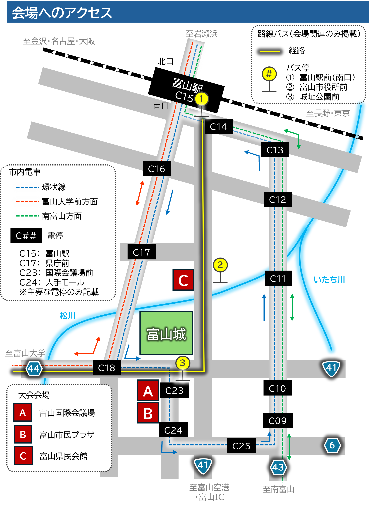

# 会場

3つの施設で開催します。

富山国際会議場  
https://www.ticc.co.jp/access/

富山市民プラザ  
https://www.siminplaza.co.jp/access

富山県民会館  
https://www.bunka-toyama.jp/kenminkaikan/access-parking/index.html

## 会場へのアクセス

会場への交通機関は、路線バスと市内電車があります。徒歩でも移動可能です。以下に主なルートを示します。利用機関によって、全国交通系ICカードの利用可否が異なりますので注意してください。

### 富山国際会議場・富山市民プラザへのアクセス

#### 1. 路線バス（富山地方鉄道株式会社）

富山駅前（南口）バスターミナル４番のりばから、「高岡駅前」、「小杉駅前」、「富山大学附属病院」、「新港東口」行きいずれかに乗車し、「城址公園前」下車（２つ目のバス停）。徒歩１分（バス進行方向左前方の建物）。
※全国交通系ICカードの利用「不可」

#### 2. 市内電車（富山地方鉄道株式会社）

富山駅電停から「環状線」に乗車し、「国際会議場前」下車。徒歩１分（市内電車進行方向右手の建物）。富山市民プラザへは、次の「大手モール」下車でも可。
※全国交通系ICカードの利用「可」

#### 3. 徒歩：富山駅から約２０分

--------------------

### 富山県民会館へのアクセス

#### 1. 路線バス（富山地方鉄道株式会社）

富山駅前（南口）バスターミナル４番のりばから発車するバス（いずれの行き先でも可）に乗車し、「富山市役所前」下車（最初のバス停）。徒歩１分（道路の向かい側の建物）。
※全国交通系ICカードの利用「不可」

<!--※他の路線でも「富山市役所前」に停車します。-->

#### 2. 市内電車（富山地方鉄道株式会社）

富山駅電停から「環状線」あるいは「富山大学前」行きに乗車し、「県庁前」下車。徒歩５分（市内電車進行方向左手の道へ）。
※全国交通系ICカードの利用「可」

#### 3. 徒歩：富山駅から約１０分

--------------------

### 参考情報

・路線バス（富山地方鉄道株式会社）  
https://www.chitetsu.co.jp/?page_id=679

・市内電車（富山地方鉄道株式会社）  
https://www.chitetsu.co.jp/?page_id=656

・富山国際会議場：アクセス  
https://www.ticc.co.jp/access/

・富山市民プラザ：アクセス  
https://www.siminplaza.co.jp/access

・富山県民会館：アクセス・駐車場  
https://www.bunka-toyama.jp/kenminkaikan/access-parking/index.html

## 宿泊場所について

- JR富山駅周辺から会場周辺にかけての宿泊施設の利用をお勧めします。
- 宿泊先をできるだけ早く確保されることをお勧めします。
