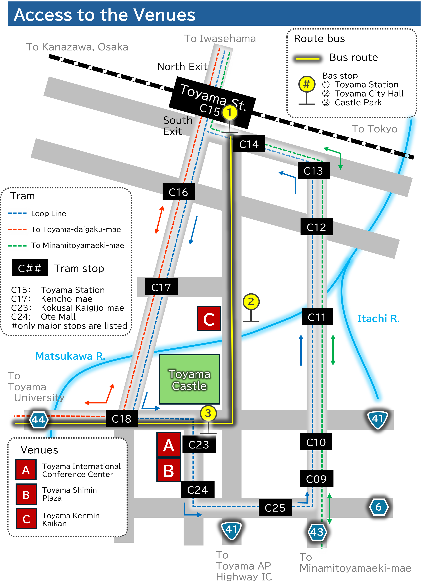

# Venue

The meeting will be held at three venues. It is a 2-minute walk from the Toyama International Conference Center to the Toyama Shimin Plaza, and a 10-minute walk from either of those venues to the Toyama Kenmin Kaikan.

<a href="https://maps.app.goo.gl/aB8MLzXtKxfi5Wv2A" target="_blank">Toyama International Conference Center</a> / <a href="https://www.ticc.co.jp/access/" target="_blank">**\[Access\]**</a>  
<a href="https://maps.app.goo.gl/G1v5xUsbwoSkGarWA" target="_blank">Toyama Shimin Plaza</a> / <a href="https://www.siminplaza.co.jp/access" target="_blank">**\[Access\]**</a>  
<a href="https://maps.app.goo.gl/Jc81jKeVBiZuh3oH9" target="_blank">Toyama Kenmin Kaikan</a> / <a href="https://www.bunka-toyama.jp/kenminkaikan/access-parking/index.html" target="_blank">**\[Access\]**</a>  
(All links lead to external sites)

## Access to the Venues

Transportation options to the venues include local buses and trams, or on foot. The main routes are outlined below. Please note that pre-paid IC travel card (e.g., Suica, ICOCA) acceptance varies depending on transportation options.

### Access to Toyama International Conference Center and Toyama Shimin Plaza

#### 1. Route Bus (Toyama Chihou Tetsudou Inc.)

From Platform 4 at the Toyama Station (South Exit) Bus Terminal, take any bus bound for "Takaoka Station," "Kosugi Station," "Toyama University Hospital," or "Shinko Higashiguchi," and get off at the second bus stop "Joshi-koen-mae (Toyama Castle Park)," then walk about 1 minute.

Note: Pre-paid IC travel cards are "not" accepted.

#### 2. Tram (Toyama Chihou Tetsudou Inc.)

From the Toyama Station tram stop, take the "Loop Line" and get off at "Kokusai Kaigijo-mae" or "Ote Mall," then walk about 1 minute. 
Pre-paid IC travel cards are accepted.

#### 3. On foot

About 20 minutes from the Toyama Station.

--------------------

### Access to Toyama Kenmin Kaikan

#### 1. Route Bus (Toyama Chihou Tetsudou Inc.)

From Platform 4 at the Toyama Station (South Exit) Bus Terminal, take any bus and get off at the first bus stop "Toyama City Hall," then walk about 1 minute.

Note: Pre-paid IC travel cards are "not" accepted.

#### 2. Tram (Toyama Chihou Tetsudou Inc.)

From the Toyama Station tram stop, take the "Loop Line" or tram bound for "Toyama-daigaku-mae" and get off at "Kencho-mae," then walk about 5 minutes. 
Pre-paid IC travel cards are accepted.

#### 3. On foot

About 10 minutes from the Toyama Station.

---------------------

### Additional Information

- <a href="https://www.chitetsu.co.jp/?page_id=679" target="_blank">Route Bus Information (Toyama Chihou Tetsudou Inc.)</a> (Japanese text only) 
- <a href="https://www.chitetsu.co.jp/english/trams/" target="_blank">Tram Information (Toyama Chihou Tetsudou Inc.)</a>

## Accommodation

We recommend staying at accommondations located between the area around JR Toyama Station and the venues.

We also recommend securing your accommodation as early as possible.

